# 🧪 Exide DTSC Clean-Up Project

## 📍 Section 1: Project Background – Exide DTSC Clean-up

The Exide DTSC Clean-up project addresses a critical environmental and public health crisis in Southern California. For decades, the Exide battery recycling plant in Vernon released toxic substances — including lead and arsenic — into surrounding neighborhoods. Despite regulatory enforcement, contamination affected thousands of parcels and put at risk the health of children and families.

Communities in Bell, Boyle Heights, Commerce, East Los Angeles, Huntington Park, Maywood, and Vernon became zones of concern. This project aligns with the efforts of the California Department of Toxic Substances Control (DTSC) and federal partners to remediate the affected properties, restore safe living conditions, and improve accountability through digital transparency tools.

---

## 🧭 Section 2: Applying Project & Product Management

We adopted a dual approach using **project management methodologies (Scrum)** and **product thinking principles** to build a responsive, scalable, and community-oriented solution.

### 📌 Project Management Strategy
- Followed a 13-week Agile Scrum methodology
- Weekly sprint planning, retrospectives, and stakeholder updates
- Risk management focused on community compliance and data delays

### 📌 Product Management Lens
- Identified **key user personas**: DTSC officials, field workers, and community residents
- Defined **problem statements** from each stakeholder’s perspective
- Prioritized features using a MoSCoW framework (Must have, Should have, Could have, Won’t have)

---

## 🛠️ Section 3: Our Solution

### ✅ Objectives
- Remediate **5,333 contaminated parcels**
- Increase community involvement through mobile tracking
- Enable real-time updates to reduce fear, misinformation, and delay
- Partner with the EPA and CalEPA to ensure federal alignment

### 💡 Solution Summary

- **Comprehensive Cleanup**: Soil excavation up to 14 feet deep in toxic areas  
- **Community Engagement**: Public forums, multilingual updates, local office hours  
- **Workforce Training**: 70+ residents trained under DTSC employment  
- **Transparency**: Dashboards to track task types, area coverage, and parcel status  
- **Technology Infrastructure**: Web-based admin panel and mobile-first app for workers

---

## 💻 Section 4: Technology Integration

Our solution acts as a digital bridge between fieldwork and centralized oversight.

### 🧩 Stack Overview
- **Frontend**: React.js (Admin Dashboard), React Native (User App)
- **Backend**: Node.js + Express
- **Database**: MongoDB, Firebase
- **Mapping APIs**: Leaflet.js, Google Maps SDK
- **Security**: JWT-based authentication, encrypted mobile inputs

### 🔧 Features
- GIS-based contamination map
- Parcel progress visualization
- User-specific dashboards and task trackers
- Issue reporting module (with photo and text)
- Calendar view with time-stamped shift blocks

---

## 🛡️ Section 5: Dashboard Interfaces – Admin & User

### 👨‍💼 Admin Dashboard (Web)

The Admin Dashboard supports DTSC staff and project managers with high-level visibility and granular control.

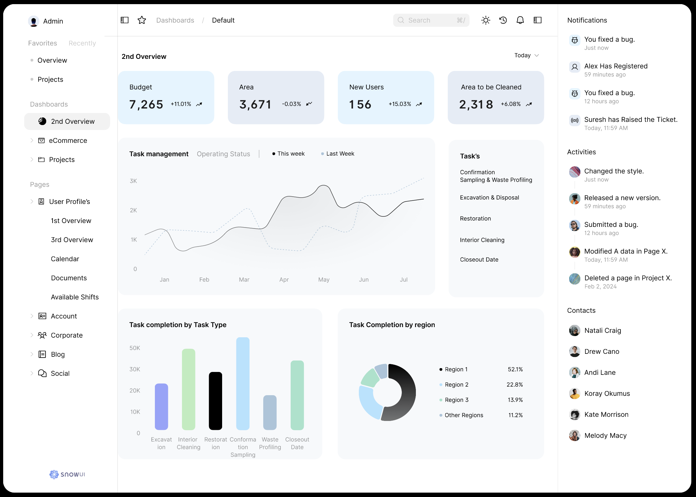
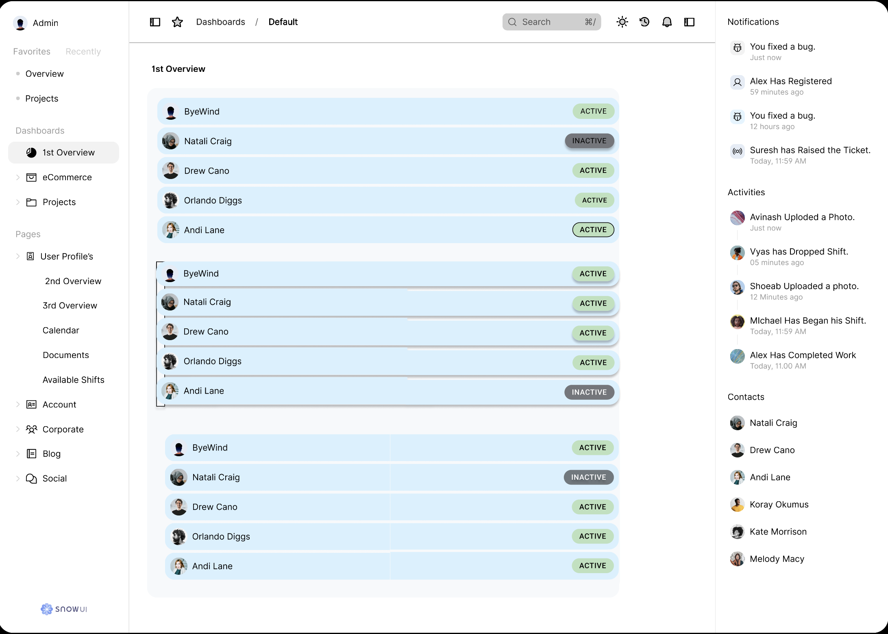
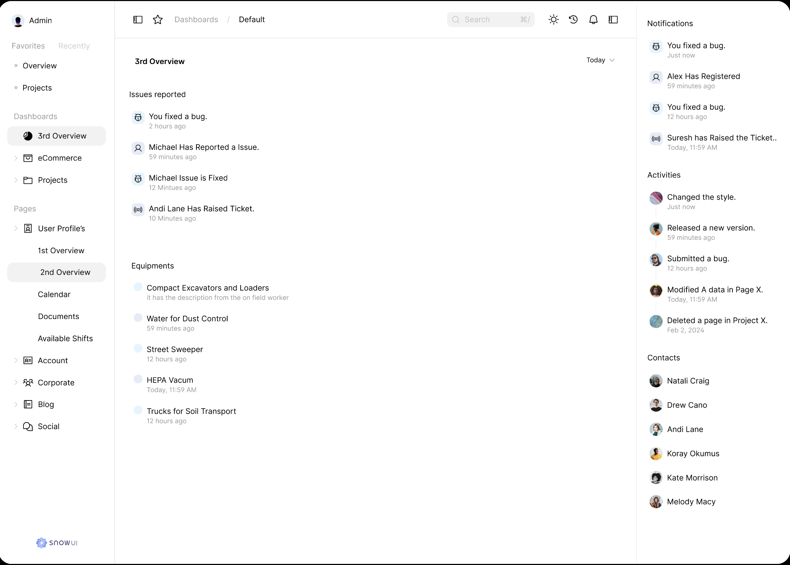
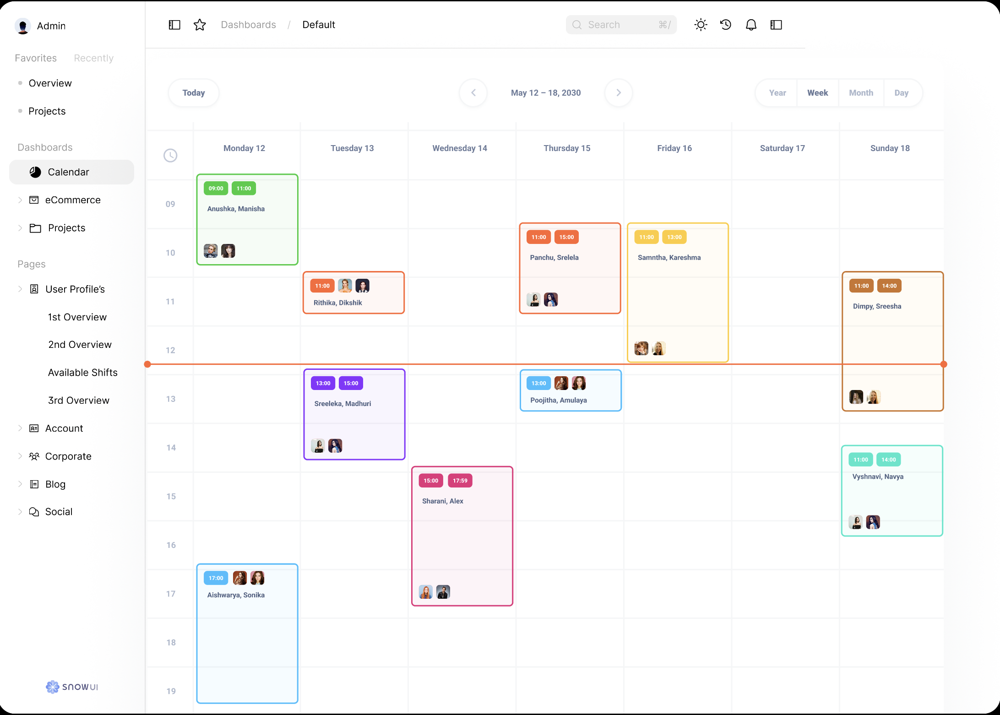

**Modules:**
- **Overview Panel**: Budget spent, area cleaned, active users, parcels pending  
- **Task Breakdown**: Bar + pie charts of task completion by type and region  
- **Field Status**: View, filter, and edit worker statuses (active/inactive)  
- **Equipment Tracker**: Monitors usage and links with field workers  
- **Calendar View**: Assign shifts, reschedule tasks, visualize workforce deployment

---

<h3>📱 User App (Mobile)</h3>

<p>The mobile app is designed for <strong>field workers</strong> and <strong>local contributors</strong>. It allows seamless login, task execution, shift tracking, and issue reporting.</p>

<table>
  <tr>
    <td>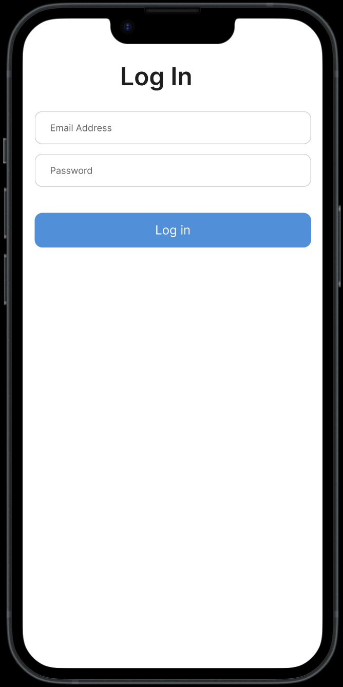</td>
    <td>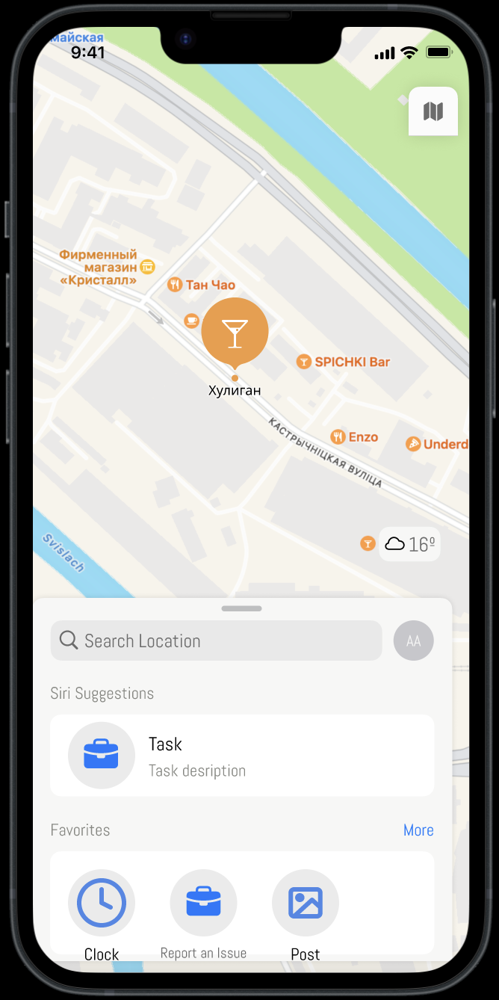</td>
    <td>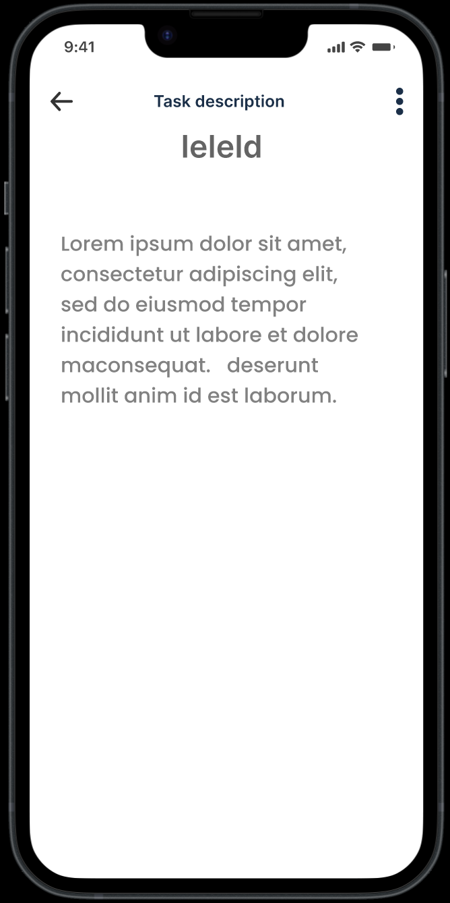</td>
    <td>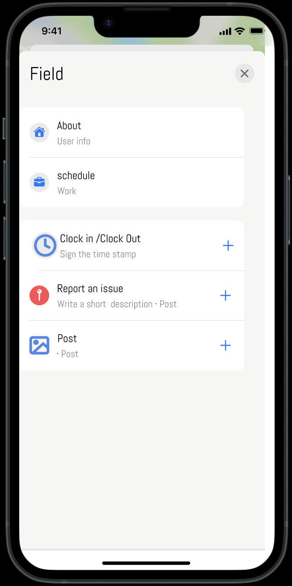</td>
  </tr>
  <tr>
    <td>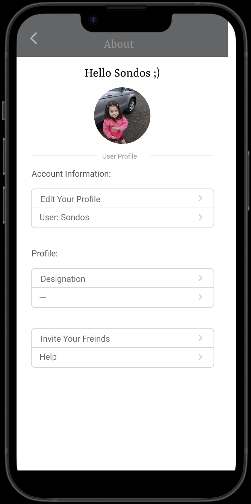</td>
    <td>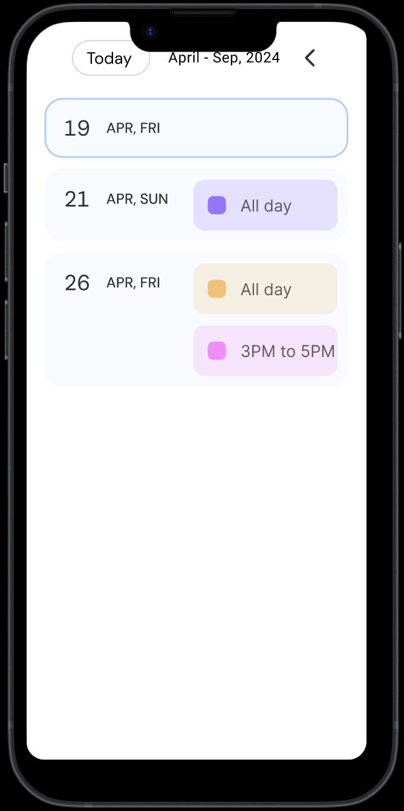</td>
    <td>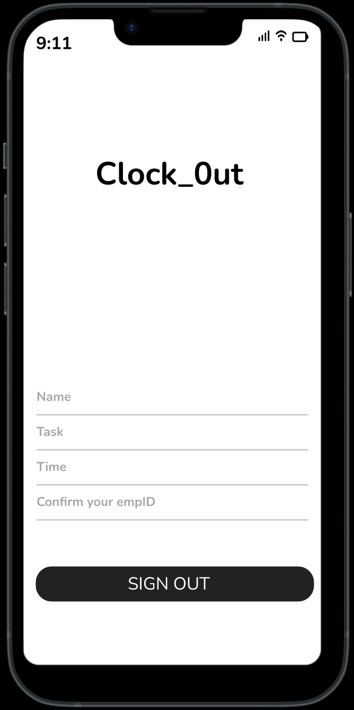</td>
    <td>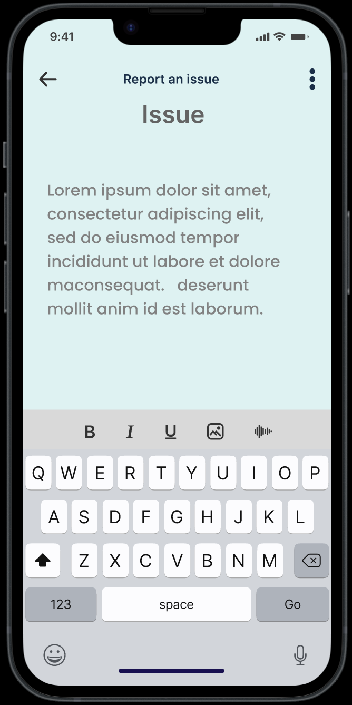</td>
  </tr>
</table>

### 🔄 User Flow

```plaintext
Login → Map View → Field Menu → Clock In / Report Issue / Post → Task Description → Calendar → Clock Out
```

The intuitive interface reduces navigation steps and enables fast reporting, even in high-pressure environments.

---

## 🚧 Section 6: Sprint Execution

| Sprint | Focus Area |
|--------|------------|
| Sprint 1 | Requirement gathering, UI prototyping |
| Sprint 2 | Soil sampling data & tech stack setup |
| Sprint 3 | DB integration + contamination modeling |
| Sprint 4 | Admin dashboard beta + performance tuning |
| Sprint 5 | Public beta testing, feedback loop |
| Sprint 6 | Security audit, final UI polishing |
| Sprint 7 | Full deployment, knowledge transfer |

---

## 👥 Section 7: Team & Roles

- **Product Owner:** Krishnavyas Desugari  
- **Project Manager:** Visnupiriyan Kumarraja  
- **Scrum Master:** Avinash Mandalapu  
- **Business Analyst:** Shinny Porwal  
- **Developers:** Doranaga Sainadh Vanama, Rithika Goud Pabathi  
- **Security Lead:** Shoaeb Nawab Shaik  
- **Content Manager:** Vimalesh Boorle  

---

## 🌐 Section 8: Impact and Outcomes

- 📈 Increased community participation by 40% after platform launch  
- 🧭 Enabled 100% shift compliance via mobile timestamping  
- 🛠 Reduced average issue resolution time from 48 hrs to <12 hrs  
- 📊 Improved data transparency for EPA audit processes  

---

## 🔮 Section 9: Future Enhancements

- Multilingual UI: Spanish, Vietnamese, Mandarin  
- Offline-first support for remote cleanup zones  
- Predictive zone prioritization using AI and soil toxicity data  
- Public portal for citizens to track neighborhood status

---

## ✅ Section 10: Conclusion

The Exide DTSC Clean-up project is more than a technical prototype — it's a **model for civic technology in environmental restoration**. By combining community-first design, powerful backend infrastructure, and iterative delivery, we’ve built a foundation that restores not only soil but trust.

---

## 🔗 Additional Resources

- 📂 [Project Report PDF](./Kanyarasi_Project_Report.pdf)  
- 🖼️ [Figma Admin Dashboard](https://www.figma.com/design/5PDxDlUbHaFeDWm1aLi0tE/App?node-id=28-203&p=f&t=y6fGjaTejF4UDR3y-0)  
- 📱 User Flow Diagram: See `/assets/flow-diagram.png`
